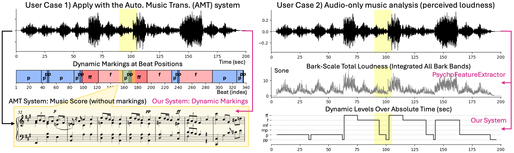
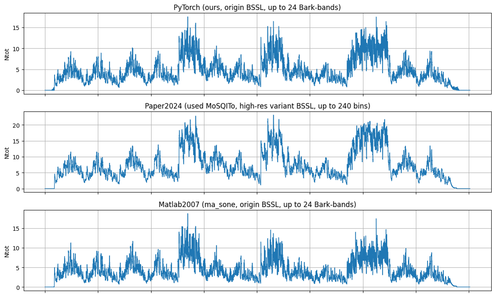

# Piano Dynamic Estimation
This repo corresponding to our submitted paper to ICASSP2026.
- Joint Estimation of Piano Dynamics and Metrical Structure with a Multi-task Multi-Scale Network [(PDF)](./figures/ICASSP2026_Dynest.pdf)

Our proposed multitask model can estimate piano dynamics, change points, beats, and downbeats from audio at once. We are polishing our model's inference stage, currntly integrates with ["High-resolution Piano Transcription (TASLP2021)"](https://arxiv.org/abs/2010.01815) system, more AMT systems in progress.

<p align="center">
  
  <br><em>Figure 1: User case demonstration.</em>
</p>

We also made a faithful PyTorch implementation of Pampalk’s **PsychoFeatureExtractor**, to provide Bark-scale specific loudness senation.

[Environment Setup](#environment-setup) &middot;
[Inference & Checkpoints](#inference-and-checkpoints) &middot;
[PsychoFeatureExtractor](#psychofeatureextractor)

If want to retrain the model or reproduce our paper results, continue the follow sections.

[MazurkaBL Dataset](#mazurkabl-dataset) &middot;
[Data Preprocessing](#data-preprocessing) &middot;
[Training & WandB](#training) &middot;
[Evaluation (Ours & Baselines)](#reproduce-metrics-from-the-paper)

## Environment Setup
Create and activate Conda env with CPU-compatible PyTorch 2.2, then Add the pip-only packages.
```
conda create -n dynest python=3.10 numpy pandas h5py "pytorch=2.2.*" "torchaudio=2.2.*" -c pytorch -c conda-forge
conda activate dynest
pip install hydra-core omegaconf wandb einops librosa mido tqdm cython
pip install "numpy<2"
pip install seaborn
pip install madmom
```
This environment is for `Ubuntu 22.04 + CUDA 12.2 + RTX3090 24GiB`. Basically it can support upper version, we also tested in `Macbook Pro M4` with the same environment, and `Ubuntu 22.04 + CUDA 12.8 + RTX5090 32GiB` using PyTorch 2.6.

## Inference & Checkpoints
Add predicted **dynamic markings** to an existing **or** AMT-transcribed score. Start with [`Inference.ipynb`](./Inference.ipynb).

- We provide a **pretrained** multi-task, multi-scale checkpoint at [`workspace/checkpoint/`](./workspaces/checkpoints/) folder. This checkpoint is our **best pre-trained** model under the 5-fold protocol, selected for real-world inference. 
- More checkpoints (other folds in formal run OR ablation variants) are available in **checkpoints.tar.gz** (Google Drive Download).

## PsychoFeatureExtractor
We implemented this PsychoFeatureExtractor in PyTorch framwork, according to the [Pampalk’s paper (2002)](https://ofai.at/papers/oefai-tr-2002-30.pdf) and [MATLAB Music Analysis Toolbox (2007)](https://www.pampalk.at/ma/documentation.html). This providing the BSSL in sones, and we compare our PsychoFeatureExtractor results with MoSQITo and MATLAB original, used their total loudness to visualize.

<p align="center">
  
  <br><em>Figure 2: Bark-scale total loudness from different implementation.</em>
</p>

**The following content is for training**

## MazurkaBL Dataset

To download the dataset, visit the github repo [MazurkaBL-master](https://github.com/katkost/MazurkaBL) to download the annotation files. Place this dataset at our [`workspace/Dataset/`](./workspaces/Dataset/) folder. The corresponding audio is available upon request (via email).

## Data Preprocessing

There are some small problems we found in MazurkaBL dataset. We solved them with the following command. You can follow our [`Data_Preprocess.ipynb`](./Data_Preprocess.ipynb) to easily handle these, as well as packaged the audio into h5 files for a quick loading.
 ```bash
python pytorch/data_preprocess.py --mode fix_problem
python pytorch/data_preprocess.py --mode cleanup_meta
python pytorch/data_preprocess.py --mode pack_h5 --sample_rate 22050
 ```

Here is the problem we found:
 1) MazurkaBL-master `M41-1` has an error. Its performance ID (pid) `9070b-01`[wrong] should be corrected to `9070b-09`[correct]. 
    Affected files:
    - MazurkaBL-master/beat_time/M41-1beat_time.csv
    - MazurkaBL-master/beat_dyn/M41-1beat_dynNORM.csv

2) MazurkaBL `M06-4` and `M63-2` does not contain regular dynamic markings. We skip these two opus by setting the `dataset.exclude_opus` in the [`pytorch/config.yaml`](./pytorch/config.yaml) file.
    ```python
    dataset.exclude_opus:
    - "M06-4"
    - "M63-2"
    ```
3) Due to the annotation quality, some pids performance will raise up the gradient dramatically during the training. NOTE: this is train-stage ONLY.  You can skip this with `null` because it is a stable training trick. If set a enough epochs (e.g., 120 epochs), the training will converge, so you won't need this.

    ```python
    dataset.exclude_pids: # null # Optional: for a stable training
    - "mazurka17-4/pid9058-13.h5"
    - "mazurka33-4/pid9080-08.h5"
    - ...

    dataset.exclude_pids: null # Regular training & evaluation
    # - ...
    ```

## Training & WandB
Once the dataset is downloaded, and the data pre-processing done, you can follow our [`Train_Model.ipynb`](./Train_Model.ipynb) to start the model training. We are doing the 5-fold cross-validation, the data is split on the Mazurka opus to becomes 5 folds, these five `split.csv` files can be found on [`workspace/`](./workspaces/). To train with 5-fold:

```bash
python pytorch/train.py wandb.note='formal latent8 mmoe8 5x5' exp.model_name=MultiTaskCNN dataset.run_all_folds=True
```

Or simple train in the first fold:
```bash
python pytorch/train.py wandb.note='formal latent8 mmoe8 5x5' exp.model_name=MultiTaskCNN dataset.run_all_folds=False dataset.fold_index=0
```
You can modify other settings in the [`pytorch/config.yaml`](./pytorch/config.yaml). Our training histroy and hyperparameter setting can be found in our [**open-available WandB workspace**](https://wandb.ai/zhanh-uwa/2025_icassp).

## Evaluation (Ours and Baselines)
All results can be found on the [`eval_and_benchmarks`](./eval_and_benchmarks/) folder. Our models `SingleTaskCNN` and `MultitaskCNN` (formal name in paper is "multitask, multiscale network) results are:

- [`Eval_Singletask.ipynb`](./eval_and_benchmarks/Eval_Singletask.ipynb)
- [`Eval_Multitask.ipynb`](./eval_and_benchmarks/Eval_Multitask.ipynb)

Beat and downbeat tracking baselines results are obtained from their original implementation in GitHub: [TCN + DBN by Bock et al.(2020)](https://tempobeatdownbeat.github.io/tutorial/intro.html) and [Beat This by F. Foscarin et al. (2024)](https://github.com/CPJKU/beat_this). We retrain their model using their own implementation. You can find the training history with the evaluation results from:

- [`beat_tcn/Eval_BeatTCN_MazurkaBL.ipynb`](./eval_and_benchmarks/beat_tcn/Eval_BeatTCN_MazurkaBL.ipynb)
- [`beat_this/Eval_BeatThis_MazurkaBL.ipynb`](./eval_and_benchmarks/beat_this/Eval_BeatThis_MazurkaBL.ipynb)

Dynamic and change point baseline is machine learning/algorithmic mehods, thereby we not reproducing their results, reported the literature instead. Download [K. Kosta PhD Thesis (2017, PDF)](https://qmro.qmul.ac.uk/xmlui/bitstream/handle/123456789/30712/Kosta_Katerina_PhD_Final_071117.pdf?sequence=1) to find these results.